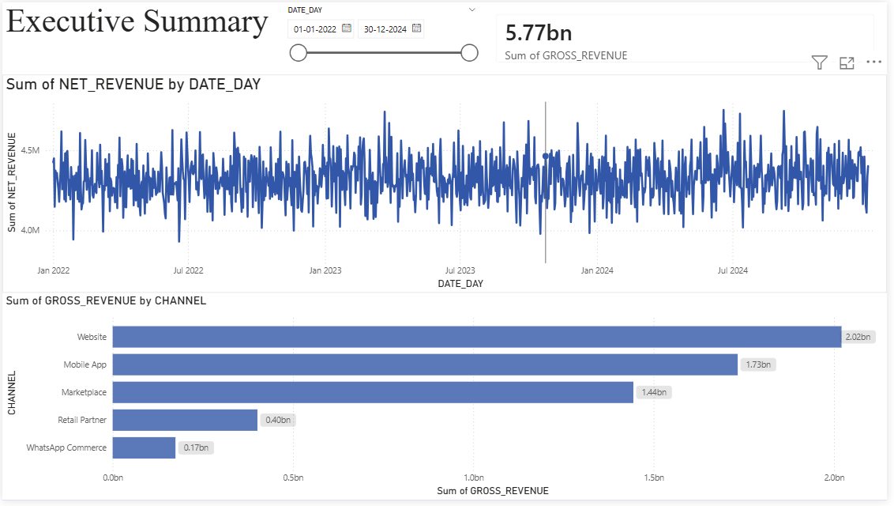
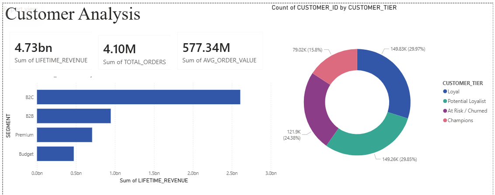
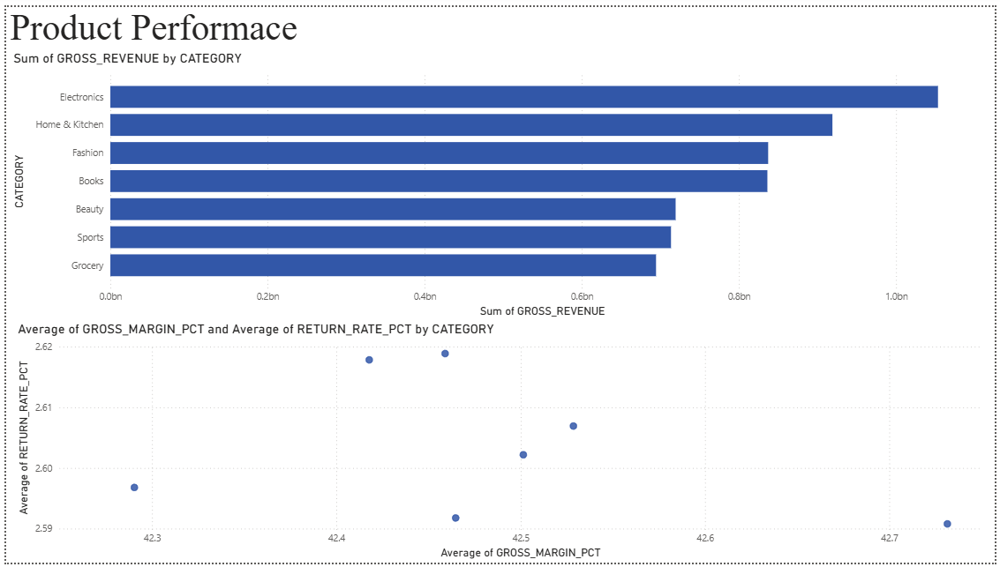
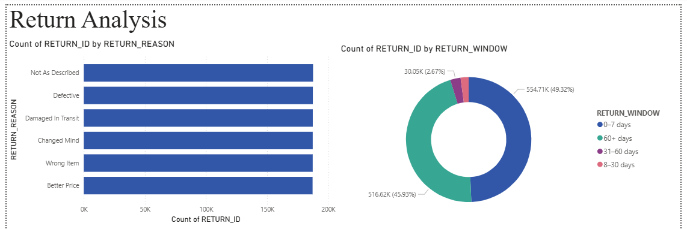

# E-Commerce Analytics Warehouse

Production-grade analytics warehouse built on **Snowflake + dbt + Airflow + Power BI DirectQuery** processing **18.9M+ synthetic e-commerce records**.

## Architecture
[Python Generator] → [Snowflake RAW] → [dbt Staging] → [dbt Marts] → [Power BI DirectQuery]
18.9M rows          5 tables         5 views          4 tables        Live Dashboard

## Tech Stack

| Tool | Purpose |
|------|---------|
| Python + NumPy | Synthetic data generation at scale |
| Snowflake | Cloud data warehouse (AWS Mumbai) |
| dbt Core | Data transformations, testing, documentation |
| Apache Airflow | Pipeline orchestration and scheduling |
| Power BI DirectQuery | Live operational dashboards |

## Data Model

**RAW Schema** — 18.9M rows across 5 tables:
- `raw_customers` — 500K customer records
- `raw_products` — 50K product catalog
- `raw_orders` — 5M order headers
- `raw_order_items` — 11.2M line items
- `raw_returns` — 1.1M return records

**STAGING Schema** — 5 dbt views (cleaned + typed)

**MARTS Schema** — 4 dbt tables (business-ready analytics):
- `mart_sales_daily` — incremental daily revenue by channel/country
- `mart_customer_360` — RFM scoring, LTV, churn tier per customer
- `mart_product_performance` — revenue, margin, return rate per product
- `mart_returns_analysis` — returns breakdown with financial impact

## dbt Features Used
- Incremental models
- Ephemeral CTEs
- Source freshness tests
- Generic + singular tests (47 passing)
- Surrogate keys via dbt_utils
- Multi-layer architecture (staging → intermediate → marts)

## Dashboard Pages

## Setup
See `README_SETUP.md` for full installation and run instructions.

## Key Metrics
- 18.9M+ rows processed
- 47 dbt data quality tests passing
- 4 mart tables serving live Power BI dashboard
- Incremental dbt model reducing compute on daily runs